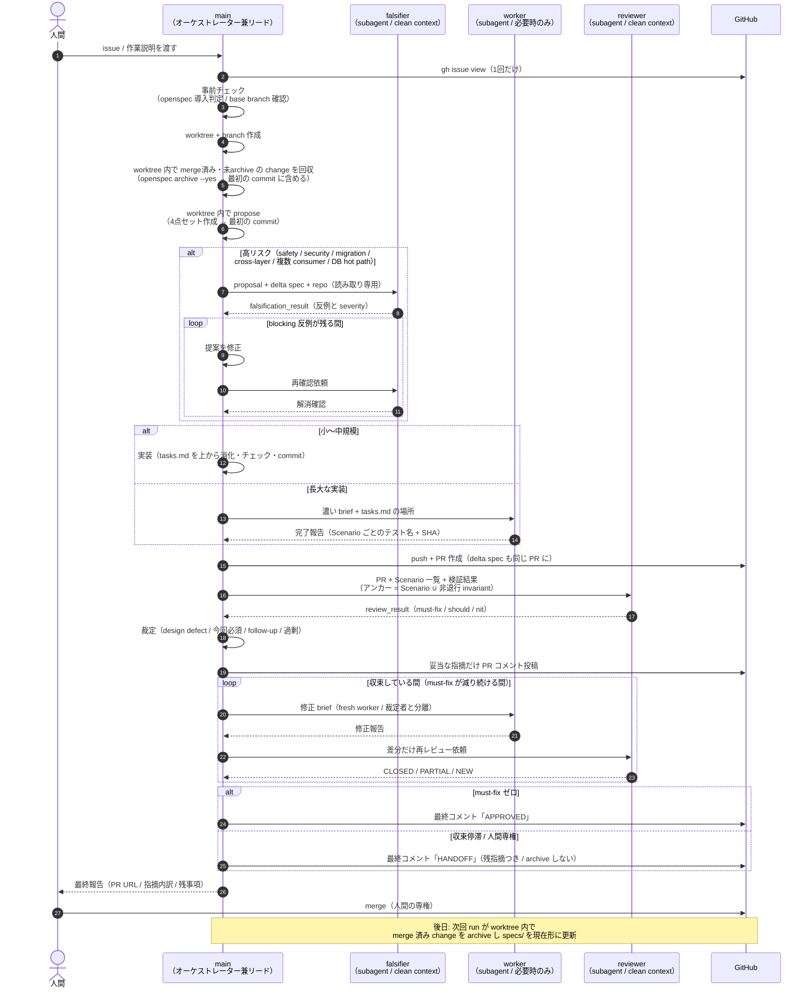

# issue-pr-autopilot

GitHub issue や作業説明を起点に、OpenSpec の propose→apply を専用 worktree 内で駆動し、反証ゲート・レビューループ・収束判定を経て、人間が短時間で merge 判断できる PR を自走で作る配送シェルです。

品質保証の最終責任は人間の PR レビューが担い、内部ループで完璧を目指しません。終了状態は APPROVED（must-fix ゼロ + G 系ゲート成立）と HANDOFF（残指摘を整理して人間レビューへ引き継ぎ）の 2 つで、どちらも正常終了です。

## 前提

- [OpenSpec](https://github.com/Fission-AI/OpenSpec) CLI（`npm install -g @fission-ai/openspec@latest`。公式チャネルは npm）
- 対象プロジェクトに `openspec/` が導入済みであること。未導入の場合、対話中はユーザーに init するか質問し、自走中は停止または軽量フォールバック（設計を PR description に直書き）に切り替えます。ユーザーの確認なしに `openspec init` は実行しません
- `gh` 認証

## OpenSpec との役割分担

| 担当 | 内容 |
|---|---|
| OpenSpec | 成果物の形式（proposal.md / delta spec / design.md / tasks.md）、進捗の外部記録、仕様の永続化（`specs/`）、archive |
| 本スキル | worktree 管理、反証ゲート（falsify スキル）、apply の駆動、PR 作成、レビューループ、収束判定、APPROVED / HANDOFF |

apply の意味論（`openspec instructions apply --json` の contextFiles を読み、tasks.md を上から消化してチェックを入れる）は本スキルが定義し、OpenSpec のスラッシュコマンド実体には依存しません。

## エージェント間の時系列



## 設計の要点

- **main がリード役**: 文脈を全部持つ main が propose・実装・裁定・収束判定を自分で行い、clean context の隔離は敵対的役割（falsifier / reviewer）に限定します。worker は長大な実装とレビュー修正ラウンド（裁定者と修正者の分離）でのみ fresh spawn します
- **正本の二層定義**: 契約の正本は issue の受け入れ条件、実行時の検証単位は delta spec の Scenario。食い違いは停止して質問します
- **意図アンカー**: 指摘の紐付け先は「delta spec の Requirement/Scenario ∪ 暗黙の非退行 invariant」。既存・未変更の欠陥は must-fix にせず follow-up 提案に分類します
- **収束性による停止**: round ごとの未解消 must-fix 数が減っている限り続行し、停滞したら HANDOFF します。round 数上限や時間では打ち切りません
- **archive は merge 後**: この run の change は run 内で archive せず、次回 run が worktree 内で merge 済み change（tasks 全完了、または対応 PR が merged のもののみ）を `openspec archive --yes` で回収し、archive 差分を最初の commit に含めて PR で確認できるようにします

## ファイル

- `SKILL.md`: スキル本体。目的と非目標、事前チェックと OpenSpec 3 分岐、エージェント構成、進め方、終了条件（G1〜G5 / HANDOFF / 安全束縛）、不変条件を定義します。
- `scripts/validation-lease.sh`: heavy validation をマシン全体で 1 本に直列化する flock ベースの lease スクリプトです。
- `agents/openai.yaml`: UI メタ情報です。

## リンク

リポジトリ root で以下を実行すると、`~/.claude/skills/issue-pr-autopilot` と `~/.codex/skills/issue-pr-autopilot` に symlink を作成できます。反証ゲートが falsify スキルを、Claude サブエージェントが無い環境では claude-rescue を参照するため、bundle での一括配布を前提とします。

```bash
make link
```
