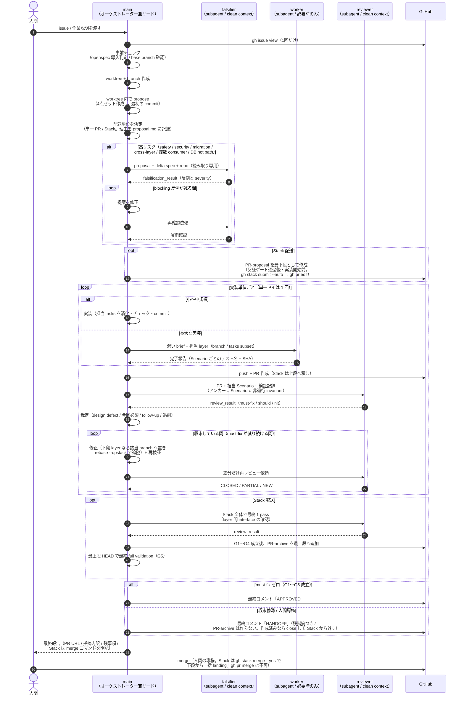

# issue-pr-autopilot

GitHub issue や作業説明を起点に、OpenSpec の propose→apply を専用 worktree 内で駆動し、反証ゲート、レビューループ、収束判定を経て、人間が短時間で merge 判断できる PR（単一 PR または GitHub Stack）を自走で作る配送シェルです。

品質保証の最終責任は人間の PR レビューが担い、内部ループで完璧を目指しません。終了状態は APPROVED（must-fix ゼロ + G 系ゲート成立）と HANDOFF（残指摘を整理して人間レビューへ引き継ぎ）の 2 つで、どちらも正常終了です。

## 前提

- [OpenSpec](https://github.com/Fission-AI/OpenSpec) CLI（`npm install -g @fission-ai/openspec@latest`。公式チャネルは npm）
- 対象プロジェクトに `openspec/` が導入済みであること。未導入の場合、対話中はユーザーに init するか質問し、自走中は停止するか、自明な単一レイヤー変更に限り軽量フォールバック（設計を PR description に直書き）に切り替えます。ユーザーの確認なしに `openspec init` は実行しません
- `gh` 認証
- Stack 配送を使う場合は [gh-stack](https://github.com/github/gh-stack) 拡張（`gh extension install github/gh-stack`）と gh-stack スキル（非対話実行の Agent rules と exit code 表の参照先）、repository での GitHub Stacked PRs の有効化。Stack が使えない場合も、gh-stack が作成済みの連鎖 base の通常 PR をそのまま使う fallback で同じ配送単位を維持します
- コード形状の規範を適用する場合は ponytail / ponytail-review スキル（ladder と 5 タグの正本）。読めない環境では規範と簡潔性 finding を不適用にして通常どおり進みます

## OpenSpec との役割分担

| 担当 | 内容 |
|---|---|
| OpenSpec | 成果物の形式（proposal.md / delta spec / design.md / tasks.md）、進捗の外部記録、仕様の永続化（`specs/`）、archive |
| 本スキル | worktree 管理、反証ゲート（falsify スキル）、配送単位の決定、apply の駆動、PR 作成、レビューループ、収束判定、APPROVED / HANDOFF |

apply の意味論（`openspec instructions apply --json` の contextFiles を読み、tasks.md を上から消化してチェックを入れる）は本スキルが定義し、OpenSpec のスラッシュコマンド実体には依存しません。

## 配送単位

単一の intent を持つ issue では「1 Issue = 1 OpenSpec change = 1 proposal」を原則とし、複数の依存 PR が必要でも change を分割しません。配送形態は propose 完了時に main が選びます。

- **単一 PR（既定）**：change の全成果物と実装を 1 つの PR で出します
- **Stack**：独立してレビューできる縦切りの実装 PR に分ける価値がある場合のみ。PR-proposal（proposal / delta spec / design / tasks）を最下段、実装 PR（PR-1 .. PR-N、それぞれが tasks の subset に trace）を中段、PR-archive（specs/ への同期と archive）を最上段とする GitHub Stack を組みます。PR-archive は全実装の収束（G1〜G4 成立）後にのみ作り、その HEAD で最終 full validation を行います。archive が実装より先に landing することはありません

Stack が使えない repository では、base branch を直下の branch に連鎖させた通常 PR で同じ構成を維持します。

## エージェント間の時系列


```mermaid
sequenceDiagram
    autonumber
    actor User as 人間
    participant Main as main<br/>（オーケストレーター兼リード）
    participant Fal as falsifier<br/>（subagent / clean context）
    participant Wkr as worker<br/>（subagent / 必要時のみ）
    participant Rev as reviewer<br/>（subagent / clean context）
    participant GH as GitHub

    User->>Main: issue / 作業説明を渡す
    Main->>GH: gh issue view（1回だけ）
    Main->>Main: 事前チェック<br/>（openspec 導入判定 / base branch 確認）
    Main->>Main: worktree + branch 作成
    Main->>Main: worktree 内で propose<br/>（4点セット作成 → 最初の commit）
    Main->>Main: 配送単位を決定<br/>（単一 PR / Stack。理由を proposal.md に記録）

    alt 高リスク（safety / security / migration /<br/>cross-layer / 複数 consumer / DB hot path）
        Main->>Fal: proposal + delta spec + repo（読み取り専用）
        Fal-->>Main: falsification_result（反例と severity）
        loop blocking 反例が残る間
            Main->>Main: 提案を修正
            Main->>Fal: 再確認依頼
            Fal-->>Main: 解消確認
        end
    end

    opt Stack 配送
        Main->>GH: PR-proposal を最下段として作成<br/>（反証ゲート通過後・実装開始前。<br/>gh stack submit --auto → gh pr edit）
    end

    loop 実装単位ごと（単一 PR は 1 回）
        alt 小〜中規模
            Main->>Main: 実装（担当 tasks を消化・チェック・commit）
        else 長大な実装
            Main->>Wkr: 濃い brief + 担当 layer（branch / tasks subset）
            Wkr-->>Main: 完了報告（Scenario ごとのテスト名 + SHA）
        end
        Main->>GH: push + PR 作成（Stack は上段へ積む）
        Main->>Rev: PR + 担当 Scenario + 検証記録<br/>（アンカー = Scenario ∪ 非退行 invariant）
        Rev-->>Main: review_result（must-fix / should / nit）
        Main->>Main: 裁定（design defect / 今回必須 / follow-up / 過剰）
        loop 収束している間（must-fix が減り続ける間）
            Main->>Main: 修正（下段 layer なら該当 branch へ置き<br/>rebase --upstack で追随）+ 再検証
            Main->>Rev: 差分だけ再レビュー依頼
            Rev-->>Main: CLOSED / PARTIAL / NEW
        end
    end

    opt Stack 配送
        Main->>Rev: Stack 全体で最終 1 pass<br/>（layer 間 interface の確認）
        Rev-->>Main: review_result
        Main->>GH: G1〜G4 成立後、PR-archive を最上段へ追加
        Main->>Main: 最上段 HEAD で最終 full validation（G5）
    end

    alt must-fix ゼロ（G1〜G5 成立）
        Main->>GH: 最終コメント「APPROVED」
    else 収束停滞 / 人間専権
        Main->>GH: 最終コメント「HANDOFF」（残指摘つき /<br/>PR-archive は作らない。作成済みなら close して Stack から外す）
    end

    Main-->>User: 最終報告（PR URL / 指摘内訳 / 残事項 /<br/>Stack は merge コマンドを明記）
    User->>GH: merge（人間の専権。Stack は gh stack merge --yes で<br/>下段から一括 landing。gh pr merge は不可）
```

## 設計の要点

- **main がリード役**：文脈を全部持つ main が propose、配送単位の決定、実装、裁定、収束判定を自分で行い、clean context の隔離は敵対的役割（falsifier / reviewer）に限定します。worker は長大な実装とレビュー修正ラウンド（裁定者と修正者の分離）でのみ fresh spawn し、レビュー修正は原則として 1 round につき 1 worker にまとめます
- **配送単位の一貫性**：1 issue の intent は 1 change として propose し、分割は PR（配送）の層で行います。Stack の変異操作（init / add / checkout / push / submit / rebase / sync / unstack）は main 専権で、worker は担当 layer の外を触らず main へエスカレーションします
- **正本の二層定義**：契約の正本は issue の受け入れ条件、実行時の検証単位は delta spec の Scenario。食い違いは fail-safe 側の最小解釈で進み、（高リスク・要人間確認）タグで人間確認事項へ転記します
- **コード形状の規範（ladder）**：スコープだけでなくコードの形にも最小充足を適用します。規範の正本は ponytail スキル（前提スキル）で、ladder（最小充足の 7 段）、`ponytail:` コメント規則、簡略化の対象外（trust boundary の入力検証・データ損失を防ぐエラー処理・security 対策）はそちらに従い、main が run 開始時に読んで worker / reviewer の brief へ展開します。ponytail が読めない環境ではこの規範と簡潔性 finding を不適用にして通常どおり進みます
- **迷ったら lazy 版で前進**：解釈が割れても停止せず、最小解釈（lazy 版）を実装して採らなかった解釈を質問として同一報告に残します。高リスク領域でも fail-safe 側の仮決め + タグ可視化で進みます。テストは「壊れたら落ちる最小の 1 チェック」を下限とし、本番配線の確認は人間レビューに委ねます
- **意図アンカー**：指摘の紐付け先は「delta spec の Requirement/Scenario ∪ 暗黙の非退行 invariant」。既存で未変更の欠陥は must-fix にせず follow-up 提案に分類します
- **最小充足と発見事項**：提案は受け入れ条件を満たす最小のものを既定とし、拡張は反証・レビュー・検証が実際に失敗を示した場合にのみ行います。実装中に見つけた紐付かない欠陥や改善点は修正せず、発見事項として列挙し follow-up に回します
- **収束性による停止**：round ごとの未解消 must-fix 数（Stack では全 PR の合算）が減っている限り続行し、停滞したら HANDOFF します。round 数上限や時間では打ち切りません
- **実行環境別のモデル割当**：main はセッションのモデル、subagent は実行環境（Claude のみ / GPT のみ / クロスモデル）ごとの割当表に従います。高リスク対象への falsifier / reviewer は main が spawn 前に 1 段上のモデルへ昇格します。割当表は SKILL.md の「モデル割当」を正とします
- **archive は実装の後**：Stack では PR-archive が Stack 最上段として archive を担い、単一 PR や partial merge・merge queue の残りは次回 run または手動が、feature PR に混ぜない独立の回収 PR（`chore:`。レビューループと G ゲートの対象外）で archive します。いずれも archive の landing が実装より先行しません

## ファイル

- `SKILL.md`：スキル本体。目的と非目標、事前チェックと OpenSpec 3 分岐、配送単位（単一 PR / Stack / fallback）、エージェント構成、進め方、終了条件（G1〜G5 / HANDOFF / 安全束縛）、不変条件を定義します。
- `scripts/validation-lease.sh`：heavy validation をマシン全体で 1 本に直列化する flock ベースの lease スクリプトです。
- `agents/openai.yaml`：UI メタ情報です。

## リンク

リポジトリ root で以下を実行すると、`~/.claude/skills/issue-pr-autopilot` と `~/.codex/skills/issue-pr-autopilot` に symlink を作成できます。反証ゲートが falsify スキルを参照するため、bundle での一括配布を前提とします。

```bash
make link
```
